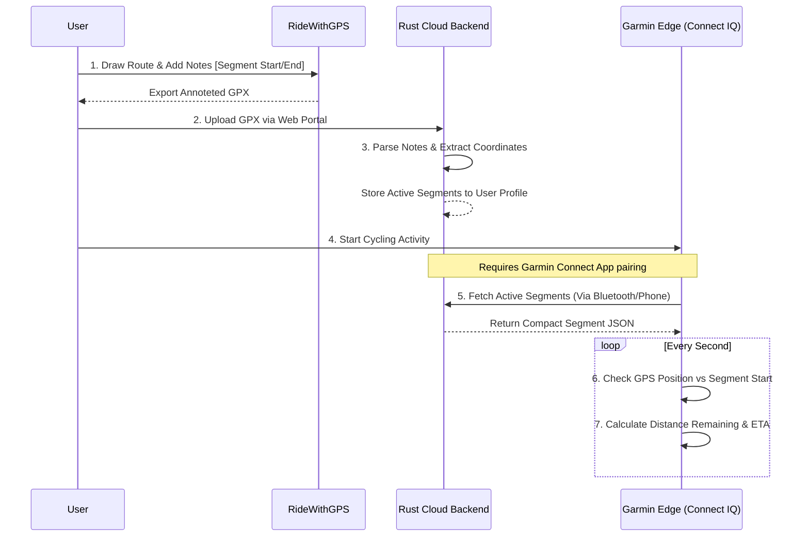

# Architecture Overview

This diagram illustrates how custom segments flow from your route planner to your Garmin Edge device.

```mermaid
sequenceDiagram
    participant U as User
    participant R as RideWithGPS
    participant B as Rust Cloud Backend
    participant G as Garmin Edge (Connect IQ)
    
    U->>R: 1. Draw Route & Add Notes [Segment Start/End]
    R-->>U: Export Annoteted GPX
    U->>B: 2. Upload GPX via Web Portal
    B->>B: 3. Parse Notes & Extract Coordinates
    B-->>B: Store Active Segments to User Profile
    U->>G: 4. Start Cycling Activity
    note over G,B: Requires Garmin Connect App pairing
    G->>B: 5. Fetch Active Segments (Via Bluetooth/Phone)
    B-->>G: Return Compact Segment JSON
    loop Every Second
        G->>G: 6. Check GPS Position vs Segment Start
        G->>G: 7. Calculate Distance Remaining & ETA
    end
```
