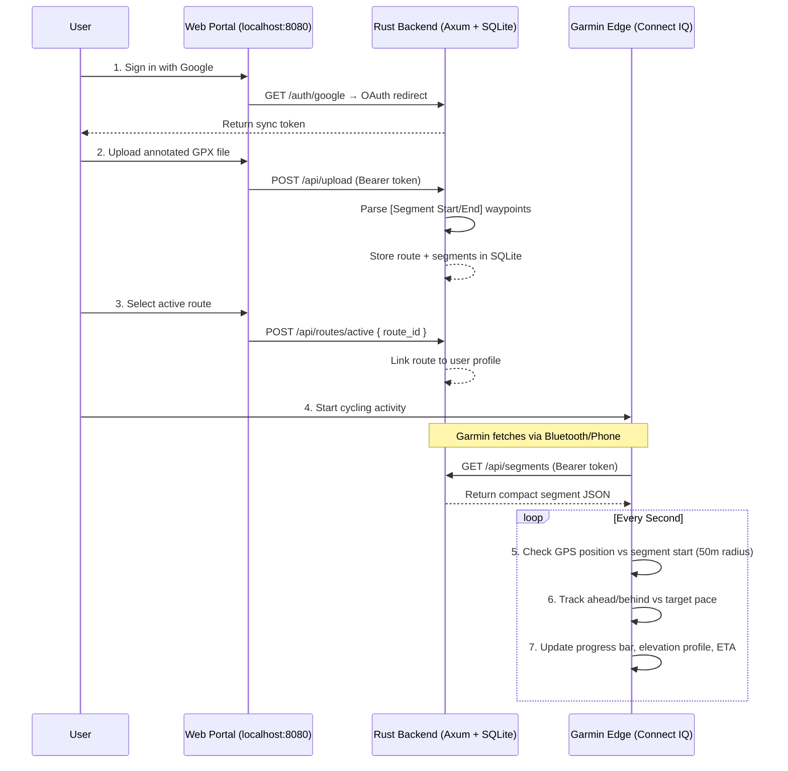

# Architecture Overview

This document illustrates how custom segments flow from your route planner to your Garmin Edge device.

## System Flow



## Component Breakdown

### Garmin App (`garmin_app/`)

| File | Responsibility |
|------|---------------|
| `LiveSegmentApp.mc` | App entry point, holds state (sync status, mock phone connection, segment tracker) |
| `LiveSegmentView.mc` | Renders the full segment screen: top bar, ahead/behind, progress bar, elevation, status icons |
| `LiveSegmentDelegate.mc` | Handles touch/button input (e.g., toggle debug mock connection) |
| `SegmentTracker.mc` | Haversine distance calc, segment start detection (50 m radius), ahead/behind interpolation |
| `CloudSyncer.mc` | Makes authenticated HTTP GET to `/api/segments`, updates sync status symbol |

Build target: **Garmin Edge 840** (`edge840`). Built using a local Docker image (`garmin-sdk-local`) wrapping the Connect IQ SDK.

### Backend (`backend/`)

| File | Responsibility |
|------|---------------|
| `main.rs` | Axum router, middleware (request logging), API handlers |
| `auth.rs` | Google OAuth flow (`/auth/google`, `/auth/google/callback`), placeholder `/signup` and `/login` |
| `gpx.rs` | Parses GPX XML to extract annotated segment waypoints |
| `db.rs` | SQLite init via SQLx (`users`, `routes` tables) |

The backend serves its own static web portal from the `public/` directory alongside the JSON API.

## Data Model (SQLite)

```
users  → token, active_route_id
routes → id, user_id, name, segments_json
```

`segments_json` is the parsed output of the GPX file, stored as a JSON string and returned verbatim to the Garmin app.
