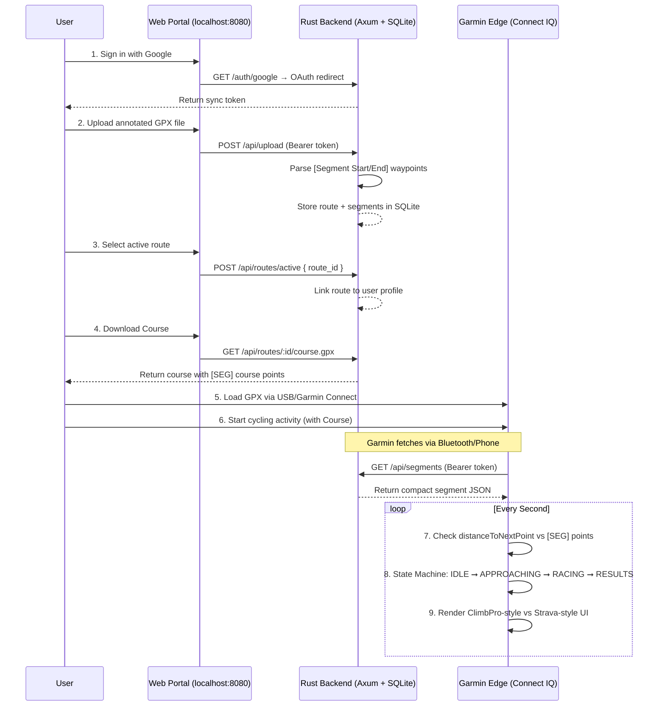

# Architecture Overview

This document illustrates how custom segments flow from your route planner to your Garmin Edge device.

## System Flow



## Component Breakdown

### Garmin App (`garmin_app/`)

| File | Responsibility |
|------|---------------|
| `LiveSegmentApp.mc` | App entry point, manages segment list and sync status |
| `LiveSegmentView.mc` | State-based renderer: ClimbPro-style (approaching) and Strava-style (racing) |
| `LiveSegmentDelegate.mc` | Handles touch/button input |
| `SegmentTracker.mc` | 4-state machine, course-point detection, ahead/behind interpolation |
| `CloudSyncer.mc` | Fetches and parses multiple segments from JSON |

Build target: **Garmin Edge 840** (`edge840`). Built using a local Docker image (`garmin-sdk-local`) wrapping the Connect IQ SDK.

### Backend (`backend/`)

| File | Responsibility |
|------|---------------|
| `main.rs` | Axum router, API handlers (routes, segments, auto-sync) |
| `course_export.rs` | Generates GPX courses with embedded [SEG] course points |
| `auth.rs` | Google OAuth flow |
| `gpx.rs` | Parses uploaded GPX files for segment discovery |
| `db.rs` | SQLite schema management |

The backend serves its own static web portal from the `public/` directory alongside the JSON API.

## Data Model (SQLite)

```
users  → token, active_route_id
routes → id, user_id, name, segments_json
```

`segments_json` is the parsed output of the GPX file, stored as a JSON string and returned verbatim to the Garmin app.
